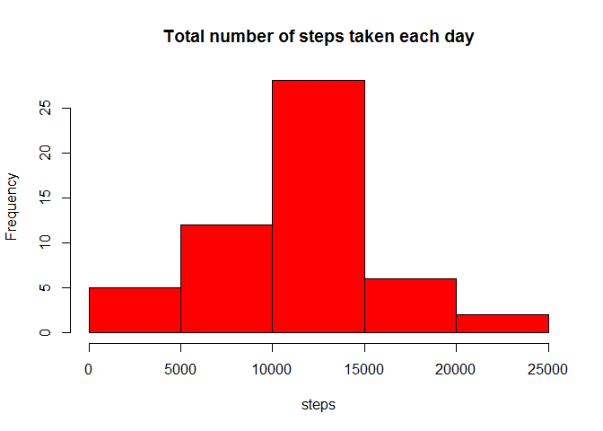
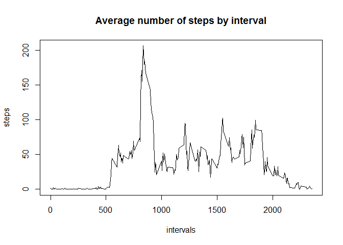
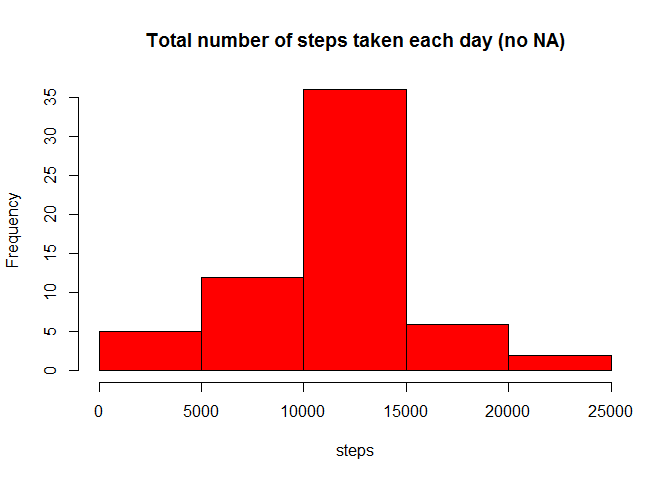
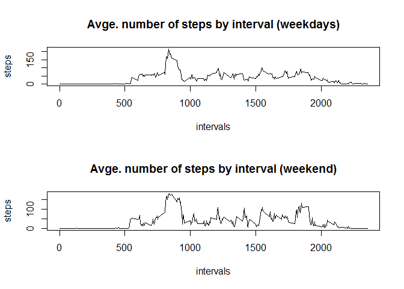

# Reproducible Research Project 1
<br>


####Loading and preprocessing the data

We read the data file and transform the data by aggregating the steps per day in each interval.


```r
data = read.csv("activity.csv", header = TRUE, sep= ";")
totalstepsday = aggregate(data$steps ~ data$date, data, sum)
```

####What is mean total number of steps taken per day?

Here is a histogram of the total number of steps taken each day


```r
hist(totalstepsday[ ,2], col = "red", xlab = "steps", main = "Total number of steps taken each day" )
```

 

To calculate the mean and median total number of steps taken per day:


```r
meansteps = mean(totalstepsday[ ,2])
mediansteps = median(totalstepsday[ ,2])
```
The mean is 1.0766189\times 10^{4} steps.
<br>
The median is 10765 steps.
<br>

####What is the average daily activity pattern?

We transform the data by taking the mean the steps per day in each interval


```r
stepsintervals = aggregate(data$steps ~ data$interval, data, mean)
```

Here is a time series plot of the 5-minute interval (x-axis) and the average number of steps taken, averaged across all days (y-axis)


```r
plot(stepsintervals[ ,1], stepsintervals[ ,2], type = "l", xlab = "intervals", ylab = "steps", main = "Average number of steps by interval")
```

 

To find which 5-minute interval, on average across all the days in the dataset, contains the maximum number of steps


```r
maxstepint = stepsintervals[ ,1][which(stepsintervals[ ,2] == max(stepsintervals[ ,2]))]
```

And the answer is 835.

####Imputing missing values

To calculate the total number of missing values in the dataset


```r
numrowswithna = nrow(data[!complete.cases(data), ])
```
And that total number is 2304.

Now we create a new dataset that is equal to the original dataset but with the missing data filled in using the mean of the 5-minute interval.


```r
datanona = data

for (w in 1:nrow(data))
{
  datanona[w, 1] = ifelse(is.na(data[w, 1]), stepsintervals[which(stepsintervals[ ,1] == data[w, 3]), 2], data[w, 1])
}
```

Now we make a histogram of the total number of steps taken each day with the missing data filled in.


```r
totalstepsdaynona = aggregate(datanona$steps ~ datanona$date, datanona, sum)
hist(totalstepsdaynona[ ,2], col = "red", xlab = "steps", main = "Total number of steps taken each day (no NA)" )
```

 

Finally, we calculate the mean and median steps


```r
meanstepsnona = mean(totalstepsdaynona[ ,2])
medianstepsnona = median(totalstepsdaynona[ ,2])
```
The mean is 1.0766189\times 10^{4} steps.
<br>
The median is 1.0766189\times 10^{4} steps.
<br> 
<br> 
Given that the missing values corresponded to whole days, there is no effect on the mean of the filling in of missing values, and only a minimal change in the median.

As for the total number of steps taken each day, we observe a shift upwards in frequency for steps ranges close to the mean/median.

####Are there differences in activity patterns between weekdays and weekends?

First, we create a new factor variable in the dataset with two levels - "weekday" and "weekend" indicating whether a given date is a weekday or weekend day.


```r
Sys.setlocale("LC_TIME","English")
```

```
## [1] "English_United States.1252"
```

```r
datanona$date = as.Date(datanona$date)
datanona$date = strptime(datanona$date, format="%Y-%m-%d")

for (v in 1:nrow(datanona))
{
  datanona$weekday[v] = ifelse(weekdays(datanona$date[v]) == "Saturday" | weekdays(datanona$date[v]) == "Sunday",  "weekend", "weekday")
}

datanonaweekday = datanona[datanona$weekday == "weekday", ]
datanonaweekend = datanona[datanona$weekday == "weekend", ]

stepsintervalsnonaweekdays = aggregate(datanonaweekday$steps ~ datanonaweekday$interval, datanonaweekday, mean)
stepsintervalsnonaweekend = aggregate(datanonaweekend$steps ~ datanonaweekend$interval, datanonaweekend, mean)
```

Then we see the difference in the weekday vs weekend pattern by making a panel plot containing a time series plot of the 5-minute interval and the average number of steps taken, averaged across all weekday days or weekend days.


```r
par(mfrow=c(2,1))
plot(stepsintervalsnonaweekdays[ ,1], stepsintervalsnonaweekdays[ ,2], type = "l", xlab = "intervals", ylab = "steps", main = "Avge. number of steps by interval (weekdays)")
plot(stepsintervalsnonaweekend[ ,1], stepsintervalsnonaweekend[ ,2], type = "l", xlab = "intervals", ylab = "steps", main = "Avge. number of steps by interval (weekend)")
```

 

